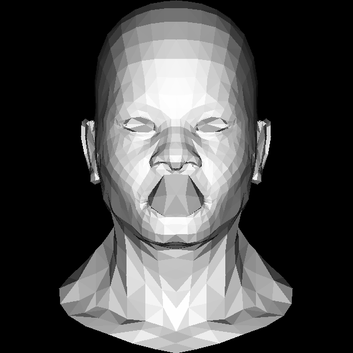

# Runderer - Rust implementation of Tiny Renderer

My attempt at [Tiny Render](https://github.com/ssloy/tinyrenderer) but instead of C++ written in Rust.

## [Part 1](https://github.com/ssloy/tinyrenderer/wiki/Lesson-1:-Bresenham%E2%80%99s-Line-Drawing-Algorithm)

Drawing lines using [Bresenham's line algorithm](https://en.wikipedia.org/wiki/Bresenham%27s_line_algorithm),
loading [Wavefront .obj](https://en.wikipedia.org/wiki/Wavefront_.obj_file) files, rendering simple mesh.

Tiny Renderer has the code for loading .obj files included, I had to twiggle around a little bit
to make everything work in rust and finally decided to go with [tobj](https://docs.rs/tobj/3.0.1/tobj/) crate
instead of writing my own.

Some more ideas for things to render later on: https://github.com/tinyobjloader/tinyobjloader
